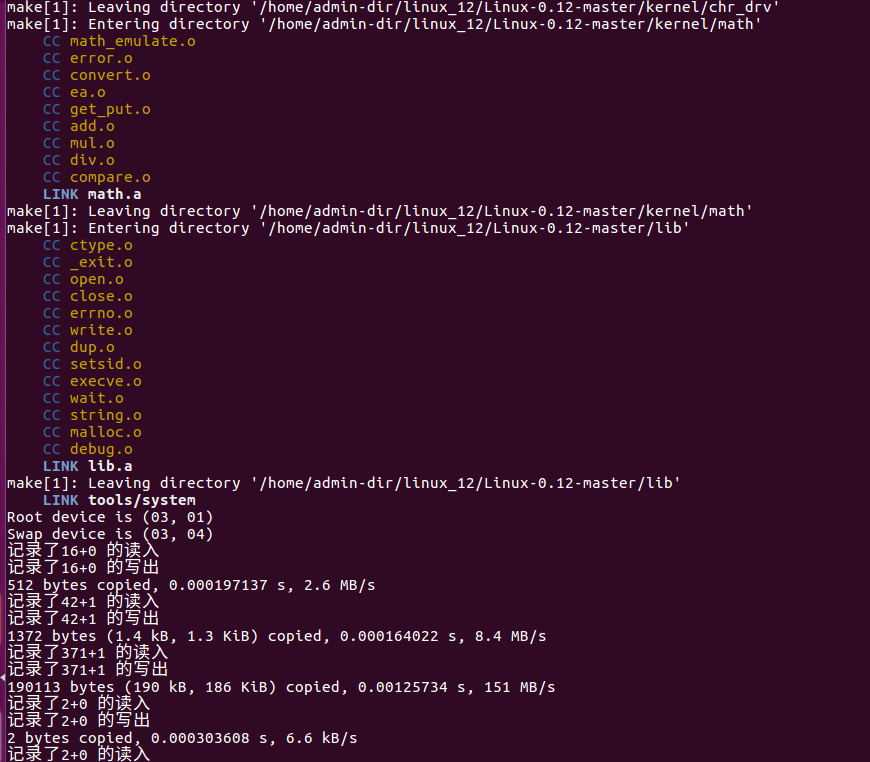
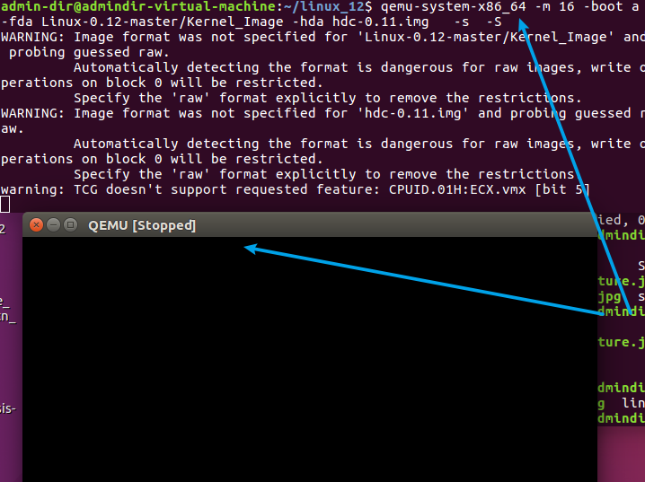
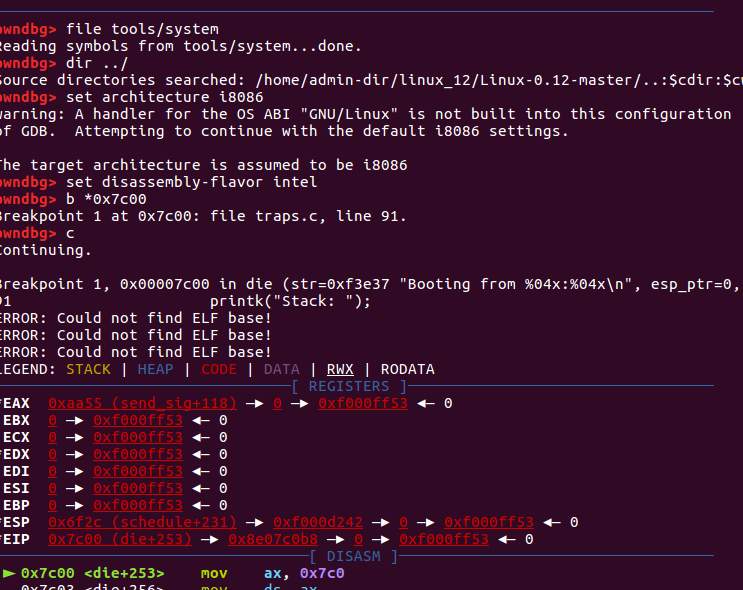
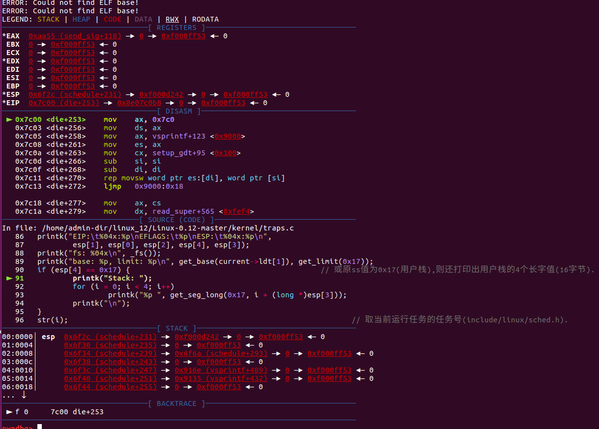
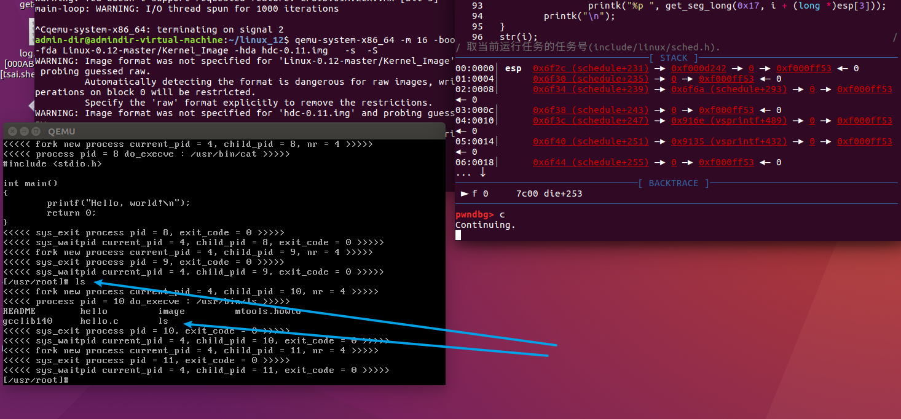

# Linux-0.12
#### 运行环境

* 
环境|版本
  ---|:-------
ubuntu16.04| ubuntu-16.04.7-desktop-amd64.iso 
gcc|5.4.0
gdb|7.11.1
qemu|2.5.0

* sudo apt install bin86

#### 编译

* make



#### 运行调试

* 首先使用qemu启动

* ```css
   qemu-system-x86_64 -m 16 -boot a -fda Linux-0.12-master/Kernel_Image -hda hdc-0.11.img   -s  -S
  
  
  -fda Image：代表你把 Image 執行目錄下  
  -hda hdc-0.11.img：是一个模拟硬盘的文件,在源码目录下可以找到
  Kernel_Image 是make后形成的
  -m：设定模拟的内存大小，本地设定为 16MB 
  -s : 服务器开启1234端口
  -S: 开始执行就挂住
  ```



* 另外启动控制台

  * ```undefined
    gdb 
    target remote localhost:1234
    file tools/system
    directory ./Linux-0.11-master //设置源码目录
    set architecture i8086 //设置成i8086模式，用来调试16位实模式代码
    set disassembly-flavor intel    //讲汇编显示成INTEL格式，好看一些
    b *0x7c00 
    c
    ```








#### 参考

* https://gitee.com/panhui123456/Linux-0.12
* https://github.com/sky-big/Linux-0.12
* https://www.jianshu.com/p/ab4fa7f12f06